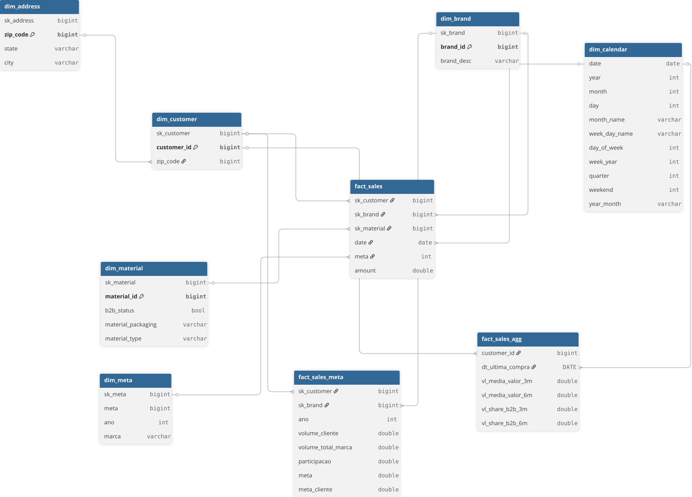

# Challenge developer dataflow to Heineken

input_files -> sales.xlsx and metas.csv (send from Heineken)

notebooks -> Contains notebooks Raw, Common and Refined data

src -> Source code in Python of Raw, Common and Refined data

